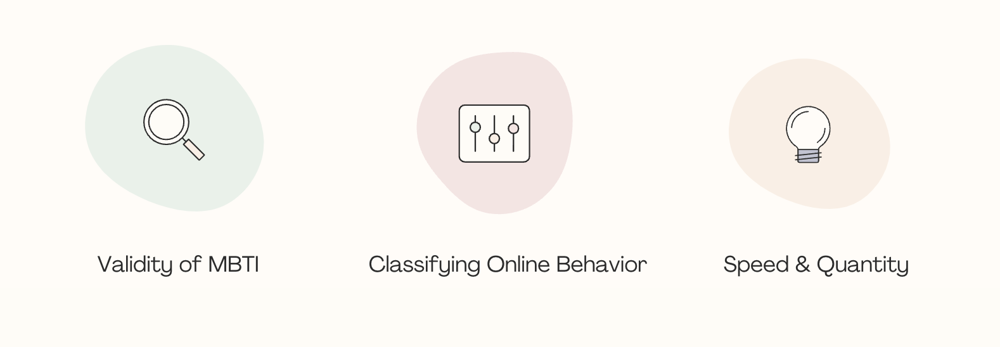
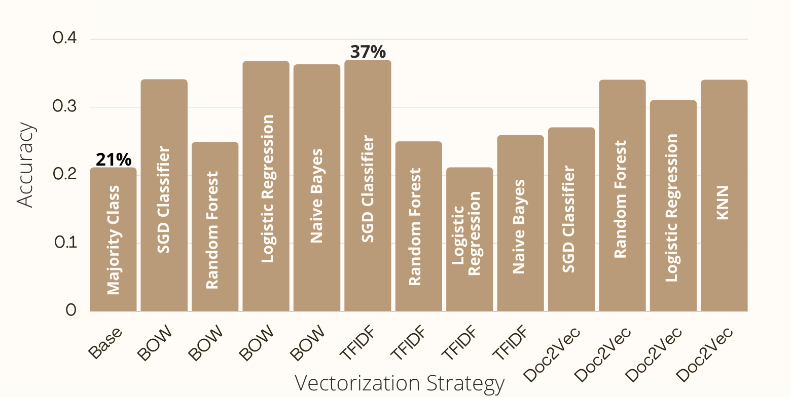
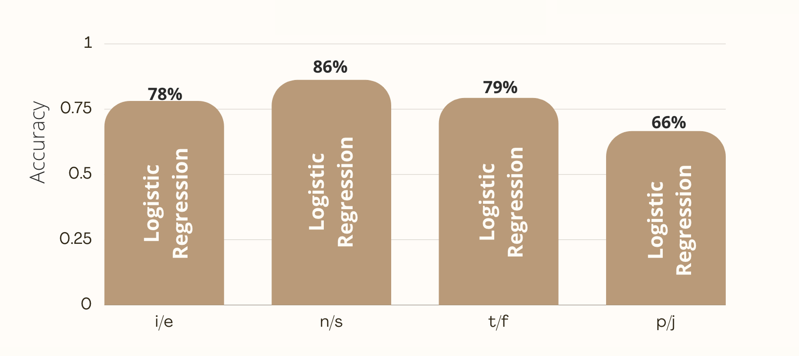
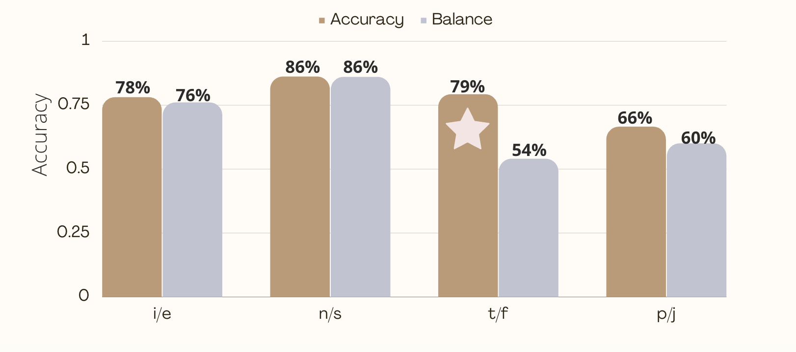
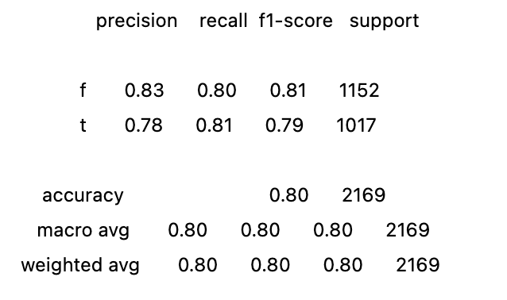
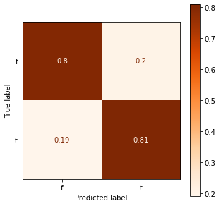
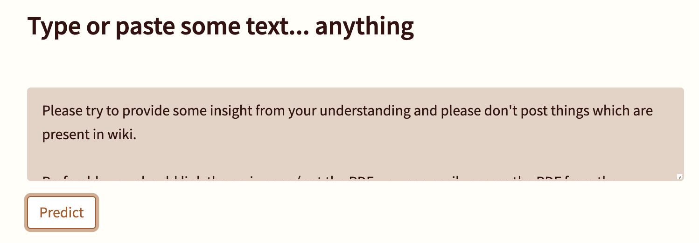
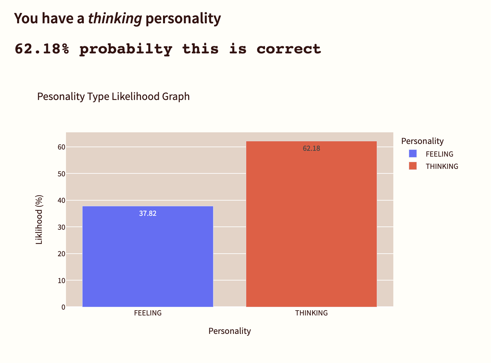
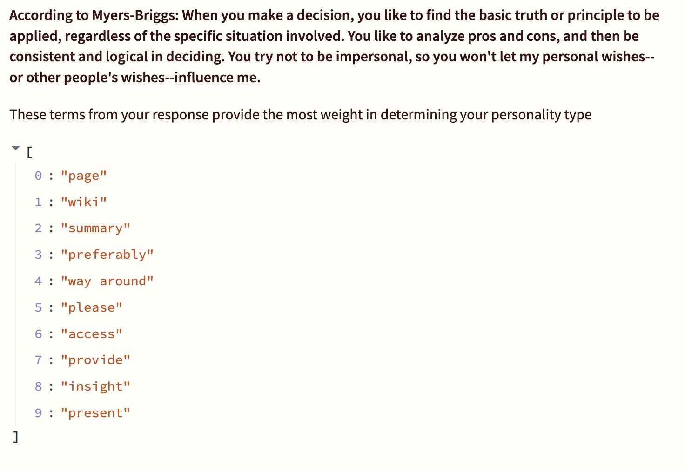

# Automatic Personality Prediction
<center></center>

#### by Weston Shuken

---

## Overview

Automatic personality detection is the automated forecasting of a personality using human-generated or exchanged contents: text, speech, videos, images, etc.

The purpose of this project is use automatic persnoality detection using text data from forum-based websites. Moreover, I will use word vectorization and machine learning models to disvoer if personality *can* be detected by a user's word usage and word choice frequencies. 

## Opportunities



There are some great opportunities that stem from this project and research:

1) Verifying validity in Myers-Briggs abilitity to segment on behavior, given the MBTI is often criticized for being unreliable (). (Kerwin, P.L., 2017). [[Download Research Paper](https://www.psychometrics.com/wp-content/uploads/2018/06/Creating-Clarity-Addressing-Micsconceptions-About-the-MBTI-Assessment-WhitePaper-1.pdf)]

2) Classifying online behavior. Text-rich platforms like social media, blogs, and forums can use implicit data to segment their customers. This segmentation is a common use of automatic personality detection, which can be used for "advertisements alignment, marketing campaigns adjustment, and supporting bloggers in narrowing down their target audiences based on community pre-detected personality traits" (Tareaf, Berger, et. al, 2018). [[Download Reaserch Paper](https://arxiv.org/pdf/1812.04346)]

3) The ability for speed and quantity of classification using automated prediction allows for bypassing questionnaire strategies. If accurate enough, populations of people and their personalities/online behavoirs could be better understood. This would add a drop in the ocean of knowledge in this widely researched topic ( Sharmaa, E., Mahajanb R., & Mansotrad, V., 2021). [[Download Research Paper](https://www.researchgate.net/publication/356603183_Automated_Personality_Prediction_of_Social_Media_Users_A_Decade_Review)]


## Data and Methods

The data used to make predictions is a collection of 50 posts per ~8,600 users on a forum-based website: [Personality Cafe](https://www.personalitycafe.com/). All of the users have self-tagged their profiles with thier Myers-Briggs Type Indicator (MBTI) personality. These personality types will be used as the **target** variables, and the collection of posts will be the **predictor** variables.

The Myers-Briggs test is a very popular test that ask users approximately 90 questions about their behavior and assigns the user a type of personality based on this assessment. This test takes around 20-30 for someone to complete. 

There are 16 different personality types using a combination of 8 overall traits. See below:

    Introversion (I) vs Extroversion (E)
    Intuition (N) vs Sensing (S)
    Thinking (T) vs Feeling (F)
    Judging (J) vs Perceiving (P)
    
*If you are unfamilar with the MBTI, please visit [Myers-Briggs Type Indicator](https://www.myersbriggs.org/my-mbti-personality-type/mbti-basics/) for more info*

Various methods were used to preprocess, vectorize, and predict:

Preprocessing Methods:

    Lowercase all words
    Remove Punctuation
    Remove non-ASCII characters
    
Vectorization Strategies:
    
    Bag of Words
    Term Frequency-Inverse Document Frequency (TF-IDF)
    Doc2Vec (from Gensim)
    
Machine Learnging Models:
    
    Stochastic Gradient Descent Classifier
    Logistic Regression
    Random Forest
    Mutlinominal Naive Bayes
    
 Evaluation Metrics:
    
    Accuracy
    F1-Score
    Testing on Reddit data


"Automatic personality prediction has become a widely discussed topic for researchers in the NLP community."

## Understanding the Dataset

The dataset has many pitfalls that will affect our modeling, and have dramatically affected the accuracy results to be overinflated and underpromising.

1. Sample vs. Population Distributions

2. Class Imbalance - 

3. Messy text data - the posts include metions about the MBTI types which can be a proxy for the actual MBIT target label

4. Not enough data - certain forums might be discussing certain topics which can be a proxy for the personality type as opposed to a causation. 

## Modeling







![Final Model]

## Results






### Thinking vs. Feeling


## Online Web App

I deployed an online application to showcase the model in action. 

The application will predict user personality as either *THINKING* or *FEEELING* based on user text input. 
The app will return a bar chart of personality probabilites and top word weights by TF-IDF scores. 

The application will also 50 posts from a user to run throught the model with the same output results. 






*The purpose of this is to inspect which words (dependent on TF-IDF weight) might be used to make predictions.*

You can try the app [HERE](https://share.streamlit.io/westonshuken/personality-prediction/main/personality_predictor.py).

## Applications of the Predictive Model

There are numerous applications for using this personality predictive model:

- Customer Segmentation
- Digital Advertising 
- Research

## Recommednations

## Next Steps

This automatic personality prediction project will be ongoing to further enhance and improve the results. 
There are many cutting edge, advanced techniques for finding contextual and semantic meaning behind words, setences and documents. Over the coming months, these techniques will be applied to the dataset as well as new data. Checklist below:

- [ ] Find/use more data
- [ ] Word Embeddings
- [ ] Neural Networks w/ LSTM
- [ ] BERT
- [ ] XLNet

## Reproducability 

This repository uses Python version 3.8.5

The dataset can be found [Kaggle](https://www.kaggle.com/datasnaek/mbti-type) or in the `data` folder on the repository.

Using environement.yml file will allow to build the environment in which works for this repository and all of the notebooks.

The requirements.txt file is used specifically for the Streamlit APP deployment via Streamlit.

**Repository Structure:**
```
├── .streamlit                             <- Contains config.toml file for Streamlit App theme
├── data                                   <- Both sourced externally and generated from code 
├── images                                 <- Both sourced externally and generated from code 
├── models                                 <- Contains pickled models for the Streamlit App
├── working_notebooks                      <- Work-in-progress & EDA notebooks
├── .gitignore                             <- For a clean repository
├── .gitattributes                         <- For LFS (large files)
├── nlp.py                                 <- Custom class for text preprocessing and running ML models
├── reddit_sample.ipynb                    <- Jupyter notebook of unseen Reddit testing data sampling 
├── README.md                              <- The top-level README for reviewers of this project
├── index.ipynb                            <- Narrative documentation of analysis in Jupyter notebook
└── presentation.pdf                       <- PDF version of project presentation
