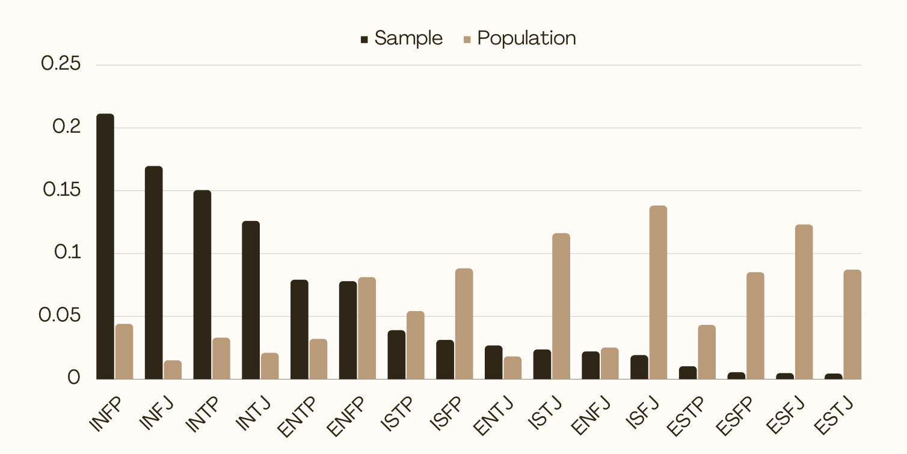
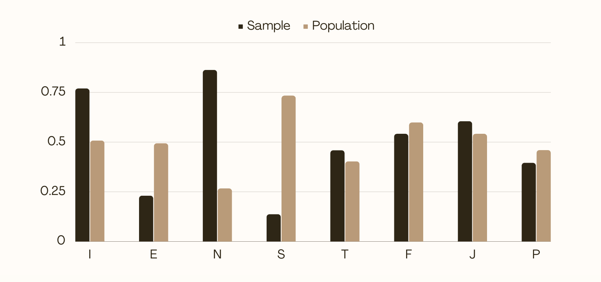
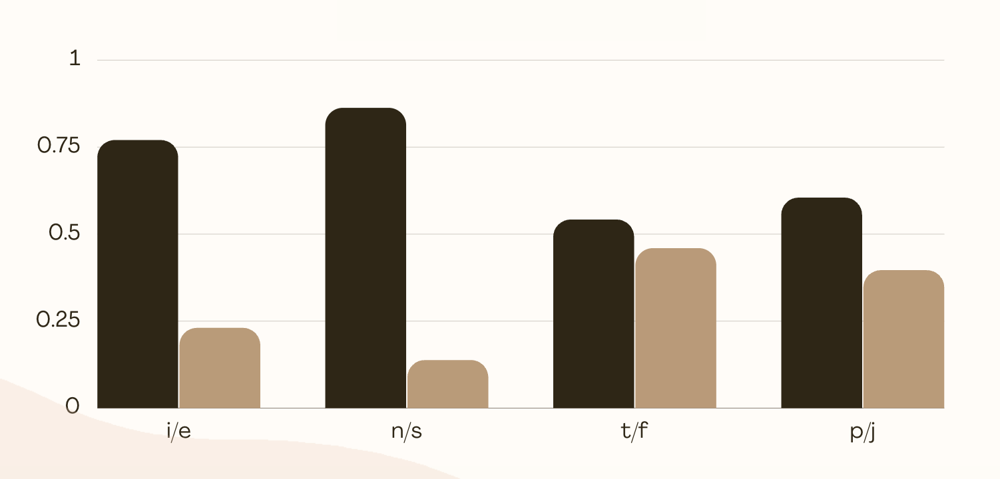
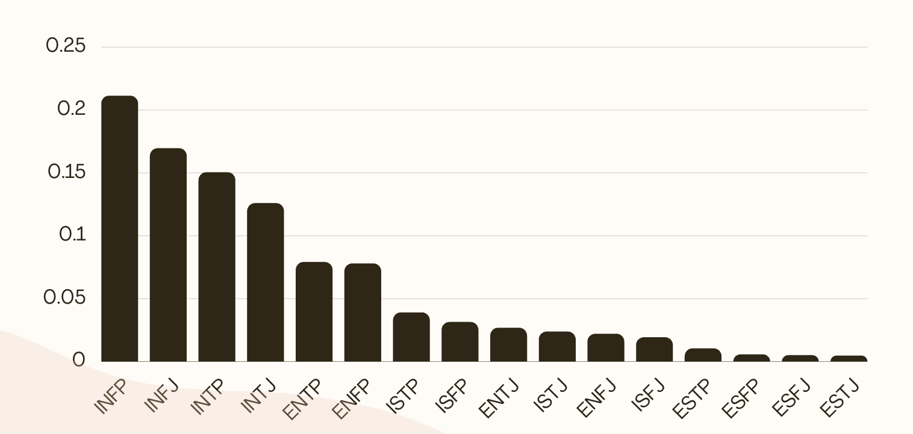
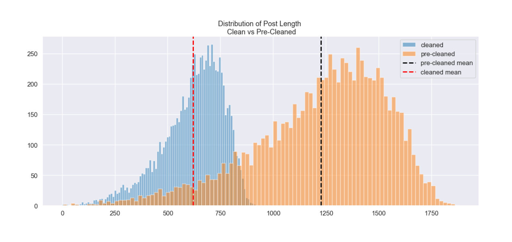
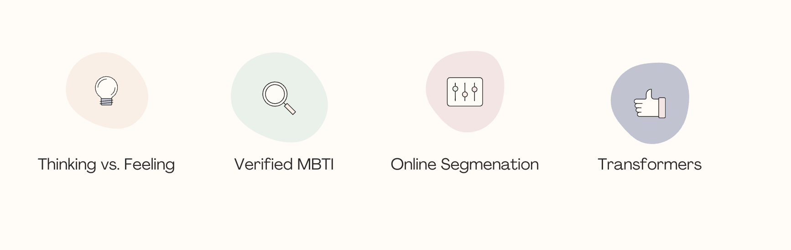

# Automatic Personality Prediction
<center></center>

#### by Weston Shuken

---

## Overview

Automatic personality detection is the automated forecasting of a personality using human-generated or exchanged contents:

- text
- speech
- videos
- images


## Opportunities


There are great opportunities that stem from this project and research:

1) Verifying validity in Myers-Briggs abilitity to segment on behavior, given the MBTI is often criticized for being unreliable (). (Kerwin, P.L., 2017). [[Download Research Paper](https://www.psychometrics.com/wp-content/uploads/2018/06/Creating-Clarity-Addressing-Micsconceptions-About-the-MBTI-Assessment-WhitePaper-1.pdf)]

2) Classifying online behavior. Text-rich platforms like social media, blogs, and forums can use implicit data to segment their customers. This segmentation is a common use of automatic personality detection, which can be used for "advertisements alignment, marketing campaigns adjustment, and supporting bloggers in narrowing down their target audiences based on community pre-detected personality traits" (Tareaf, Berger, et. al, 2018). [[Download Reaserch Paper](https://arxiv.org/pdf/1812.04346)]

3) The ability for speed and quantity of classification using automated prediction allows for bypassing questionnaire strategies. If accurate enough, populations of people and their personalities/online behavoirs could be better understood. This would add a drop in the ocean of knowledge in this widely researched topic ( Sharmaa, E., Mahajanb R., & Mansotrad, V., 2021). [[Download Research Paper](https://www.researchgate.net/publication/356603183_Automated_Personality_Prediction_of_Social_Media_Users_A_Decade_Review)]


## Data and Methods

The data used to make predictions is a collection of 50 posts per ~8,600 users on a forum-based website: [Personality Cafe](https://www.personalitycafe.com/). All of the users have self-tagged their profiles with thier Myers-Briggs Type Indicator (MBTI) personality. These personality types will be used as the **target** variables, and the collection of posts will be the **predictor** variables.

The Myers-Briggs test is a very popular test that ask users approximately 90 questions about their behavior and assigns the user a type of personality based on this assessment. This test takes around 20-30 for someone to complete. 

There are 16 different personality types using a combination of 8 overall traits. See below:

    Introversion (I) vs Extroversion (E)
    Intuition (N) vs Sensing (S)
    Thinking (T) vs Feeling (F)
    Judging (J) vs Perceiving (P)
    
*If you are unfamilar with the MBTI, please visit [Myers-Briggs Type Indicator](https://www.myersbriggs.org/my-mbti-personality-type/mbti-basics/) for more info*

Various methods were used to preprocess, vectorize, and predict:

Preprocessing Methods:

    Lowercase all words
    Remove URLs
    Remove Punctuation and symbols
    Remove non-ASCII characters
    Remove Digits
    Tokenizing
    Lemmatizing w/ POS tags
    Create binary labels
    
Sentiment Analysis

    NLTK VADER
    TextbBlob 

Vectorization Strategies:
    
    Bag of Words
    Term Frequency-Inverse Document Frequency (TF-IDF)
    Doc2Vec (Gensim)
    
Machine Learnging Models:
    
    Stochastic Gradient Descent Classifier
    Logistic Regression
    Random Forest
    Mutlinominal Naive Bayes
    
 Evaluation Methods/Metrics:
    
    Train Test Split
    Accuracy
    F1-Score
    Testing on Reddit data

## Understanding the Dataset

Dataset Statistics:

   - ~8,600 Users with 50 posts each
   - The pre-cleaned tokens tally up to 10637645 total words
   - The cleaned tokens tally up to 5378285 total words
   - Each feature in pre-cleaned has on average 1226 words
   - Each feature in cleaned has on average 620 words
   - Each feature in pre-cleaned  has a median of 1278 words
   - Each feature has a median of 645 words

The dataset has many pitfalls that will affect our modeling, and have dramatically affected the accuracy results to be overinflated and underpromising.

1. Sample vs. Population Distributions

#### Class Sample vs Population Bar 

#### Binary Sample vs Population Bar 



2. Class Imbalance - The classes on the dataset are imbalanced by total 16 personality types and by the binary classes


#### Binary Imbalance Bar


#### Class Imbalance Bar


3. Messy text data - the posts include many symobls, punctuation, and common words. Also, some posts mention the MBTI types which can be a proxy for the actual MBIT target label. Through preprocessing methods this can be fixed.

**Precleaned Post snippet**:

`We seem to have alot of ENFP's in my family lol|||I know how you feel, my dad's the same way. He thinks that I'm not practical enough, and that I never get things done the way he wants them done. He is the most difficult person in the world to...|||ENTJ/ESTJ I feel are the hardest to deal with. They talk to you like you're 10 years old, even when you are the same age as them. They are bossy, mean, and narcissistic. ISFJ's have their good `

**Cleaned Post snippet**:

`seem alot family lol know feel dad way think im practical enough never get thing do way want do difficult person world feel hard deal talk like youre year old even age bossy mean narcissistic good`

#### Cleaned vs. Pre-cleaned Post Word Length


4. Not enough data - certain forums might be discussing certain topics which can be a proxy for the personality type as opposed to a causation. 


## Modeling

We see an increase from 21% baseline of prediction the majority class to a 37% accuracy of an SGD classifier w/ TF-IDF vectorization. 
While not an objectively high accuracy score, the models are gaining information in some form or another.

#### Multiclass Modeling Accuracy Results


Instantly we can see an increase in accuracy across the board using simple Logistic Regression and TF-IDF vectorization.

#### Binary Modeling Accuracy Results


However, the class is imbalanced. so really only 

#### Binary Modeling Accuracy Results vs. Majority Class Balance


#### Thinking vs. Feeling
the Thinking vs. Feeling traits are providing a significant gain in accuracy score over the imbalance. Meaning that the model is mainly able to capture the differences in users' online text behavior and word choice by the Thinking vs Feeling traits. B

## Final Model Results & Evaluation

#### Final Model:
- TF-IDF Vectorizer
    - ngram_range=(1,2) 
    - min_df=2
- SGDClassifier
    -  class_weight={'f': .45, 't': .55}, 
    -  loss="modified_huber"
- 80% Accuracy
- 80% F-1 Score


#### Some of the Top Words by Class and TF-IDF


## Online Web App

Model deployment in an online application to showcase the model in action. 

The application will predict user personality as either *THINKING* or *FEEELING* based on user text input. 
The app will return a bar chart of personality probabilites and top word weights by TF-IDF scores. 

The application will also generate 50 posts to run through the model. 


*The purpose of this is to inspect which words (dependent on TF-IDF weight) might be used to make predictions.*

You can try the app [HERE](https://share.streamlit.io/westonshuken/personality-prediction/main/personality_predictor.py).

## Conclusion



The task was quite difficult and the dataset was flawed, but it was possible to predict *THINKING* vs. *FEELING* types at a decently high-level simply given text chatter from this forum website. 

This verifies to a degree that *THINKING* vs. *FEELING* Myers Briggs types can be segmented by implicit user text data.

This discovery and tool can be used by social media or text-based internet companies to develop targeting strategies for digital advertising and understanding their customer base between *THINKING* vs. *FEELING* types.

The next step I will be taking is using transformers and more data to derive semantic and contextual meaning from the words to uncover more insights.

## Next Steps

This automatic personality prediction project will be ongoing to further enhance and improve the results. 
There are many cutting edge, advanced techniques for finding contextual and semantic meaning behind words, setences and documents. Over the coming months, these techniques will be applied to the dataset as well as new data. Checklist below:

- [ ] Find/use more data
- [ ] Word Embeddings
- [ ] Neural Networks w/ LSTM
- [ ] BERT
- [ ] XLNet

## Final Thoughts 


## Reproducability 

This repository uses Python version 3.8.5

The dataset can be found on [Kaggle](https://www.kaggle.com/datasnaek/mbti-type) or in the `data` folder on the repository.

Using environement.yml file will allow to build the environment in which works for this repository and all of the notebooks.

The requirements.txt file is used specifically for the Streamlit APP deployment via Streamlit.

#### For more information
Please contact the contributors to this analysis: 
[Weston Shuken](https://www.linkedin.com/in/westonshuken/)

**Repository Structure:**
```
├── .streamlit                             <- Contains config.toml file for Streamlit App theme
├── data                                   <- Both sourced externally and generated from code 
├── images                                 <- Both sourced externally and generated from code 
├── models                                 <- Contains pickled models for the Streamlit App
├── working_notebooks                      <- Work-in-progress & EDA notebooks
├── .gitignore                             <- For a clean repository
├── .gitattributes                         <- For LFS (large files)
├── nlp.py                                 <- Custom class for text preprocessing and running ML models
├── reddit_sample.ipynb                    <- Jupyter notebook of unseen Reddit testing data sampling 
├── README.md                              <- The top-level README for reviewers of this project
├── index.ipynb                            <- Narrative documentation of analysis in Jupyter notebook
└── presentation.pdf                       <- PDF version of project presentation
